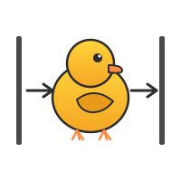

<div align="center">



# **DOER**

### `stdin → agent → stdout`

**A Unix citizen that thinks. In text, images, audio, and video.**

[](https://pypi.org/project/doer-cli/)
[](LICENSE)
[](https://python.org)
[](https://doer.duck.nyc)

📖 **[Full documentation →](https://doer.duck.nyc)**

</div>

---

## install

```bash
# pipx — isolated, auto-updatable (recommended)
pipx install doer-cli

# pip — any venv
pip install doer-cli

# optional extras
pip install 'doer-cli[mlx]'   # local inference + LoRA training (Apple Silicon)
pip install 'doer-cli[vlm]'   # vision/audio/video + VLM LoRA
pip install 'doer-cli[hf]'    # huggingface dataset upload
pip install 'doer-cli[all]'   # everything
```

Two binaries land on `$PATH`: **`do`** (short) and **`doer`** (long).

> `do` is a shell keyword in bash/zsh loops — the binary still works because of the argument (`do "hi"` is unambiguous), but if tab-completion misbehaves, alias it:
> ```bash
> echo 'alias do="doer"' >> ~/.zshrc
> ```

## run

```bash
# text
do "find files larger than 100MB"

# pipe
cat error.log | do "what broke"
git log -20   | do "write release notes"
curl -s api.io | do "summarize" | tee out.md

# multimodal (auto-routes to mlx-vlm on Apple Silicon)
do --img screenshot.png "what's in this UI?"
do --audio meeting.wav   "transcribe and bullet the action items"
do --video clip.mp4      "what's happening here?"
do --img a.png --audio b.wav "..."   # omni model (auto-picked)
```

## what it is

```python
Agent(
    model=<auto: bedrock | ollama | mlx | mlx-vlm>,
    tools=[shell] + hot_reload("./tools"),
    system_prompt=SOUL.md + AGENTS.md + ~/.doer_history
                + ~/.bash_history + ~/.zsh_history + own_source,
)(stdin + argv + images + audio + video)
```

**One file.** `doer/__init__.py` — ~730 lines. Reads your shell like a person reads a room. Trains on its own transcripts. Swaps its own brain.

## context it sees every call

| source                               | what                                                   |
| ------------------------------------ | ------------------------------------------------------ |
| `SOUL.md` (cwd)                      | who it is in this project                              |
| `AGENTS.md` (cwd)                    | rules for this project                                 |
| `~/.doer_history`                    | last N Q/A (`DOER_HISTORY=10`)                         |
| `~/.bash_history` + `~/.zsh_history` | last N commands (`DOER_SHELL_HISTORY=20`)              |
| `./tools/*.py`                       | hot-reloaded `@tool` functions                         |
| own source                           | full self-awareness                                    |
| `--img / --audio / --video`          | raw media sent to a VLM (routed automatically)         |

No database. No config file. **The filesystem is the memory.**

## providers

Auto-picked from what's on your machine. Override with `DOER_PROVIDER`.

| provider  | when                                                        | model default                                   |
| --------- | ----------------------------------------------------------- | ----------------------------------------------- |
| `bedrock` | AWS creds present (`AWS_BEARER_TOKEN_BEDROCK` / STS / SSO)  | `global.anthropic.claude-opus-4-7` (1M ctx)     |
| `mlx-vlm` | Apple Silicon + `[vlm]` extra + `--img/--audio/--video`     | `Qwen2.5-VL-3B` / `gemma-3n` / `Qwen3-Omni`     |
| `mlx`     | Apple Silicon + `[mlx]` extra (text-only, trained adapter)  | `mlx-community/Qwen3-1.7B-4bit`                 |
| `ollama`  | fallback — local, private, no keys                          | `qwen3:1.7b`                                    |

```bash
# force a provider
DOER_PROVIDER=ollama do "quick ping"
DOER_PROVIDER=mlx DOER_ADAPTER=~/.doer_adapter do "use my trained self"
```

## env knobs

```bash
# provider selection
DOER_PROVIDER=                   # "" (auto) | bedrock | ollama | mlx | mlx-vlm

# bedrock (defaults tuned for Claude Opus 4.7)
DOER_BEDROCK_MODEL=global.anthropic.claude-opus-4-7
DOER_BEDROCK_REGION=us-west-2
DOER_MAX_TOKENS=128000           # Opus 4.7 native max
DOER_TEMPERATURE=                # unset on Opus 4.7+ (returns 400 otherwise)
DOER_TOP_P=                      # unset on Opus 4.7+
DOER_CACHE_PROMPT=               # "1" / "true" → prompt caching
DOER_ANTHROPIC_BETA=context-1m-2025-08-07   # csv; auto on Claude — "" to disable
DOER_ADDITIONAL_REQUEST_FIELDS=  # raw JSON escape hatch
DOER_BEDROCK_GUARDRAIL_ID=       # optional Bedrock guardrail
DOER_BEDROCK_GUARDRAIL_VERSION=

# ollama
DOER_MODEL=qwen3:1.7b
OLLAMA_HOST=http://localhost:11434

# mlx (Apple Silicon)
DOER_MLX_MODEL=mlx-community/Qwen3-1.7B-4bit
DOER_ADAPTER=                    # path to trained text LoRA
DOER_MLX_VLM_MODEL=mlx-community/Qwen2.5-VL-3B-Instruct-4bit
DOER_MLX_AUDIO_MODEL=mlx-community/gemma-3n-E2B-it-4bit
DOER_MLX_OMNI_MODEL=mlx-community/Qwen3-Omni-30B-A3B-Instruct-4bit
DOER_VLM_ADAPTER=                # path to trained VLM LoRA

# context
DOER_HISTORY=10                  # Q/A rows in prompt
DOER_SHELL_HISTORY=20            # shell rows in prompt
DOER_DEBUG=                      # "1" → verbose errors
DOER_MAX_SEQ_LEN=16384           # LoRA training max seq length

# huggingface upload
DOER_HF_REPO=<user>/doer-training   # override target
HF_TOKEN=                           # or `huggingface-cli login`
```

## extend in 60 seconds

```python
# ./tools/weather.py
from strands import tool
import urllib.request

@tool
def weather(city: str) -> str:
    """Weather for a city."""
    return urllib.request.urlopen(f"https://wttr.in/{city}?format=3").read().decode()
```

Next call: `do "istanbul weather?"` — hot-reloaded, no restart.

## the loop: collect → train → swap

`doer` closes its own training loop. Every call appends a **dense, self-contained record** to `~/.doer_training.jsonl` — full system prompt, all messages, tool specs, native `<tool_call>` tokens preserved.

```bash
# 1. collect (automatic — just use doer)
do "fix this stacktrace" < err.log
do --img ui.png "label the bugs in this screenshot"
# ... 100+ real turns across text/image/audio/video

# 2. inspect
do --train-status
# → 127 turns | 2453.1KB | sha256:250c406b | ~/.doer_training.jsonl
#     text:102  image:18  audio:3  video:4
#     hf:    cagataydev/doer-training | in sync

# 3. train — in-process LoRA (no trainer indirection, ~50 lines calling mlx_lm.tuner)
do --train 200                # text LoRA     → ~/.doer_adapter
do --train-vlm 300            # vision LoRA   → ~/.doer_vlm_adapter

# 4. use your trained self
DOER_PROVIDER=mlx     DOER_ADAPTER=~/.doer_adapter         do "fix this" < err.log
DOER_PROVIDER=mlx-vlm DOER_VLM_ADAPTER=~/.doer_vlm_adapter do --img x.png "what's this?"
```

Training preserves native tool-call tokens via the tokenizer's chat template — your adapter learns **real** tool-use, not string mimicry.

## train in the cloud (HuggingFace Jobs)

Laptop LoRA is great for 500-turn datasets on Qwen3-1.7B. When you want to scale up — bigger models, full fine-tunes, VLM, Omni — burn HF credits instead of your battery.

```bash
# one-shot dispatchers (UV scripts, zero setup)
doer --hf-jobs text                    # Qwen3-1.7B LoRA, T4, ~$0.30
doer --hf-jobs vlm                     # Qwen2.5-VL-3B LoRA, A100, ~$5
doer --hf-jobs omni                    # Qwen2.5-Omni-7B, H200, ~$10

# override anything via env or flags
MODEL=Qwen/Qwen3-4B FLAVOR=a10g-large doer --hf-jobs text --iters 1000

# monitor
doer --hf-jobs ps
doer --hf-jobs logs <job_id>
doer --hf-jobs hw          # list hardware + cost/hour
```

Under the hood each dispatcher is one self-contained UV script bundled inside `doer/hf_jobs/` — no repo cloning, no Dockerfile. The script pulls `cagataydev/doer-training` (your dataset), runs SFT LoRA with `trl` + `peft`, merges the adapter, and pushes the full merged model to `cagataydev/doer-<model-short>` automatically.

**Validated end-to-end on T4-medium ($0.60/hr):**
- 522 turns → 468 train / 53 eval
- Qwen3-1.7B, LoRA r=16 (17.4M params, 1% of base)
- 50 steps, 33 min → eval_loss **0.149**, token accuracy **97.6%**
- 3.44 GB merged model auto-pushed to private HF repo

Use the trained model anywhere:

```bash
DOER_PROVIDER=transformers DOER_MODEL=cagataydev/doer-qwen3-17b do "what is doer"
```

See the bundled [`hf_jobs/README.md`](doer/hf_jobs/README.md) (also accessible at `$(doer --hf-jobs)/README.md` after install) for full details and the three trainers (`train_text_lora.py`, `train_vlm.py`, `train_omni.py`).

## share the dataset (HuggingFace)

```bash
pip install 'doer-cli[hf]'

do --upload-hf                       # → <user>/doer-training (private)
do --upload-hf cagataydev/my-data    # custom repo
do --upload-hf-public                # public dataset
```

Idempotent — one atomic commit per run (`train.jsonl` + README with schema/stats/sha). Reuses `huggingface-cli login` or `HF_TOKEN`. `--train-status` shows local sha vs last remote commit.

**Round-trip anywhere:**

```bash
hf download cagataydev/doer-training --repo-type dataset --local-dir /tmp/d
cp /tmp/d/data/train.jsonl ~/.doer_training.jsonl
do --train 200
```

## philosophy

```
┌─────┐       ┌──────┐       ┌──────┐
│stdin│──────▶│  do  │──────▶│stdout│
└─────┘       └──────┘       └──────┘
```

`grep` with a brain. Chain it. Script it. Cron it.

Read [**SOUL.md**](SOUL.md) for the manifesto. Read [**AGENTS.md**](AGENTS.md) for the rules.

## family

| project                                              | size      | purpose                                                       |
| ---------------------------------------------------- | --------- | ------------------------------------------------------------- |
| **doer**                                             | ~730 LOC  | one pipe, one shell, one file, one loop (collect→train→swap) |
| [**DevDuck**](https://github.com/cagataycali/devduck) | 60+ tools | every protocol, every edge                                    |

## uninstall

```bash
pipx uninstall doer-cli    # or: pip uninstall doer-cli
rm /usr/local/bin/do       # if installed via binary
```

## license

Apache-2.0 · built in New York · 2026

---

<div align="center">

**`do one thing and do it well`** — Doug McIlroy, 1978

</div>
